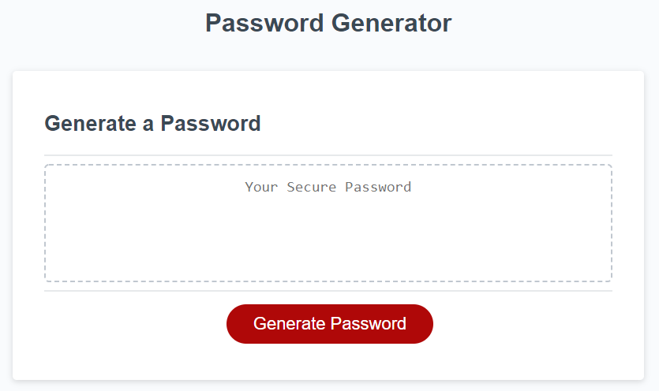
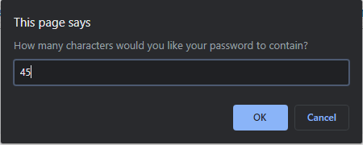
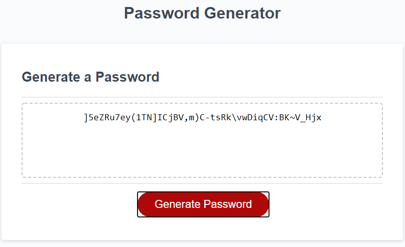

# generateSecureMe

***Securing Passwords for everyone***
```
In this assignment we needed to make a password generator.
In this generator we need to make sure that certain characters were included for the user:

-Numbers
-upperCaseLetters
-lowerCaseLetters
-Special 

We then linked up a "Generate Button"
This button then generate a random password for the user
The CSS and HTML was already done for us. Our primary focus was rendering JavaScript
```

## Home Page


> You are able to click the generate me button that will bring a series of command prompt 

***figure 1.1***



> Once you have answered all the prompts your password will generate like this




## LINKS

- [generateSecureMe Deployed](https://nicholasd-uci.github.io/generateSecureMe/)
- [Github Repo Link](https://github.com/nicholasd-uci/generateSecureMe)
- [Nicholas Dallas's GitHub](https://github.com/nicholasd-uci)

- - -
© 2020 NPRD, Nicholas Paul Ruiz Dallas